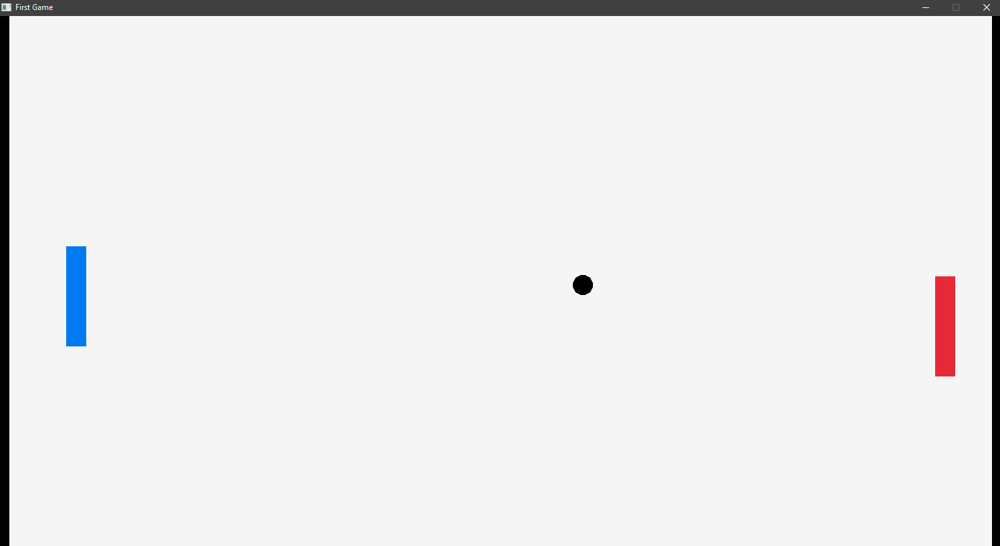

# CPingPong

Ping Pong game made with C and raylib.



## About this project

I'm learning C from scratch, and this is one of my practice projects along the way. I'm using it to test out what I've learned so far (variables, loops, if statements, functions) combined with raylib for graphics. This isn't professional code, just a learning exercise and a fun way to see concepts working on screen instead of just in the terminal.

## What it does

Two paddles (red and blue) move up and down, and a ball bounces around the screen and off the paddles. Basic Pong.

## How the code works

**Window setup**

The game opens an 1500x800 window using `InitWindow()`, and runs at a fixed frame rate with `SetTargetFPS()`. Everything below happens inside the main game loop (`while (!WindowShouldClose())`), which repeats many times per second for as long as the window is open.

**Paddles**

Each paddle is just a rectangle drawn with `DrawRectangle()`. Its vertical position is stored in a variable (`b` for the red paddle, `d` for the blue one), and that variable changes based on keyboard input:

```c
if (IsKeyDown(KEY_UP))    b -= 5;
if (IsKeyDown(KEY_DOWN))  b += 5;
if (IsKeyDown(KEY_W)) d -= 5;
if (IsKeyDown(KEY_S)) d += 5;
```

Red paddle uses the arrow keys, blue paddle uses W/S. Holding a key down keeps changing the position every frame, which reads as smooth movement.

**Ball movement**

The ball's position (`circlex`, `circley`) updates every frame based on a constant `speed` value and a `direction` for each axis (`directionX`, `directionY`), which is either `1` or `-1`:

```c
circlex += speed * directionX;
circley += speed * directionY;
```

Multiplying speed by direction means the ball always moves at the same rate, but the sign of `directionX`/`directionY` controls which way it's currently heading.

**Bouncing off walls**

Every frame, the code checks if the ball has reached the top/bottom or left/right edge of the window. If it has, the corresponding direction flips:

```c
if (circley <= 0 || circley >= heightwindow) {
    directionY = directionY * -1;
}
```

**Bouncing off paddles**

This checks whether the ball's edge has reached the paddle's edge, and whether it's within the paddle's height range, before flipping the horizontal direction. It's a simplified collision check, not a fully robust one, but it works well enough for this scale of project.

## Built with

- C
- [raylib](https://www.raylib.com/)

## Status

Still a work in progress as I keep learning more C. Next steps might include score tracking, resetting the ball after a point, and cleaning up the collision detection.
